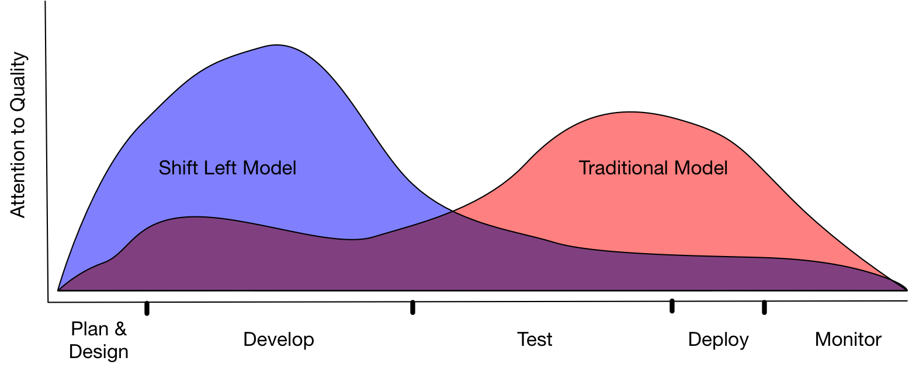
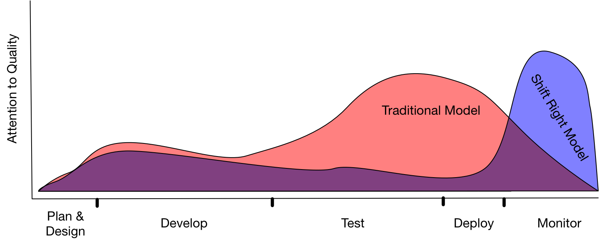

# Shift Left 
## Keep Calm ... and know your tests

---

## What does @color[#DC143C](Shift Left) mean exactly?

---

@snap[north span-100 text-center]

####  Move quality to the left ... to your developers!

@fa[quote-left text-08 text-blue](Testing leads to failure, and failure leads to understanding.)

@css[text-05 text-blue text-right](Burt Rutan)

@snapend

@snap[midpoint span-80]



@snapend

@snap[south-west span-30 text-06 fragment]
@box[rounded](Benefit 1 #Collaborate and ... Collaborate!)
@snapend

@snap[south span-30 text-06 fragment]
@box[rounded](Benefit 2. Query #Test early, Test often!)
@snapend

@snap[south-east span-30 text-06 fragment]
@box[rounded](Benefit 3 #Find your bugs early!)
@snapend

---

@snap[north span-100 text-center text-12]

#### When there is a LEFT ... there must be a RIGHT!

@fa[quote-left text-08 text-blue](I have to keep testing myself.)
@css[text-05 text-blue text-right](Eartha Kitt)

@snapend

@snap[midpoint span-80]



@snapend

@snap[south-west span-30 text-06 fragment]
@box[rounded](Done in #Production)
@snapend

@snap[south span-30 text-06 fragment]
@box[rounded](Done for #Performance or UX tests)
@snapend

@snap[south-east span-30 text-06 fragment]
@box[rounded](Done with #A sophisticated monitoring)
@snapend

---

@snap[west span-40 text-08]

Benefit 1: Collaboration
But with whom?


@snapend

@snap[north-east span-40 text-08 fragment]
@box[rounded](Take over #testing responsibility)
@snapend

@snap[east span-40 text-08 fragment]
@box[rounded](Learn to #communicate between Biz, Dev and Test)
@snapend

@snap[south-east span-40 text-08 fragment]
@box[rounded](Understand #to Code as a Tester)
@snapend

---

@snap[west span-40 text-08]

Benefit 2: Test early, Test often

Automation

@snapend

---

@snap[north-west span-30 text-08]
@box[rounded](DSL #Domain Specific Language)
@snapend

@snap[west span-30 text-08 fragment]
@box[rounded](BPT #Business Process Testing)
@snapend

@snap[south-west span-30 text-08 fragment]
@box[rounded](Code #Use Frameworks like Selenium)
@snapend

@snap[north-east span-60 text-04 fragment]

````
/* ELV Test Cases*/        
Testcase testCase_GP026(id:14897){
    Shop.loginWithPassword(User:user_PrivateCustomerOrgNr2_3)
    Basket.add(product:Product_Good_PLZCard_7PctTax_Above15EUR amount:1)
    Shop.checkout(shippingAddress:Address_allUsers_DEU_Simple_1 payment:Payment_SDD)
    Shop.logout
}
````

@snapend

@snap[south span-30 fragment]

@box[bg-blue](Pros)

@ol
 - first pro 
 - second pro
@olend

@snapend

@snap[south-east span-30 fragment]

@box[bg-grey](Cons),

@ol
 - first con 
 - second con
@olend

@snapend

---

Wenn wir unsere Tests nun zum Entwickler bringen müssen diese automatisiert werden.

Mehrere Versuche


---

## How do we bring tests to Developers, without being technical!

Note:

- If you bring you your 

---

## Embrace BDD and Gherkin! 

### Describe what you want from your system in simple examples.

---

### What are the basic features of Gherkin?

`````gherkin
Feature: As a Mathematician I want to use a calculator to add 
  and subtract numbers, so that I dont have to do it myself.

  The ADDITION:
  Other names for Addition are Sum, Plus, Increase, Total.
  The numbers to be added together are called the "Addends":

  Scenario: Add two positive numbers
    Given Steven is using a WebCalculator
    When He adds the numbers 123 and 345
    Then He should get the result 468
`````

@[1-2](Summary about the examples which are about to follow)
@[4-6](Detailed description of the feature)
@[8](Description of the expected behaviour)
@[8-11](The three main parts of a scenario)
@[1-11](And combined we have a nice description what the system should do)

Note:

- communicate within a team and discuss examples not abstract Stories or requirements

---

### What about data sets?

````gherkin
Feature: As a Mathematician I want to use a calculator 
  to do a large number of calculations to speed up my project

  Scenario Outline: Do multiple calculations
    Given Steven is using a WebCalculator
    When He adds the numbers <firstNumber> and <secondNumber>
    Then He should get the result <result>
    Examples:
      | firstNumber | secondNumber | result |
      | 10          | 5            | 15     |
      | 10          | -5           | 5      |
````

@[4](Use a scenario outline)
@[6-7](Insert placeholder for your data set)
@[6-11](Describe your data set in a simple table)
@[1-11](Add data to the table as you like)

Note:

- the examples are data driven
- as a tester think about pairwise testing
- We can have multiple Given, When, Then steps

---

## What is the Screenplay Pattern?

---
### How does a simple test look like?
````typescript
const Bernhard = Actor.named("Bernhard");

Bernhard.can(BrowseTheWeb.using(aBrowser));

return Bernhard.attemptsTo(
    Navigate.to("http://localhost:3000"),
    
    Click.on(Calculators.NUMBER_BUTTON("3")),
    Click.on(Calculators.NUMBER_BUTTON("0")),

    Click.on(Calculators.ADD_BUTTON),

    Click.on(Calculators.NUMBER_BUTTON("5")),

    Click.on(Calculators.RESULT_BUTTON),

    See.if(Text.of(Calculators.RESULT_FIELD))
        .is(strictEqualTo("35")),
)
````

@[1](Create an actor)
@[3](Give an ability to the actor)
@[5-16](The actor executes interactions)
@[17-18](The actor asks a question)

---

### How do we deal with varying number sizes?

````typescript
const Bernhard = Actor.named("Bernhard");

Bernhard.can(BrowseTheWeb.using(aBrowser));

return Bernhard.attemptsTo(
    Navigate.to("http://localhost:3000"),

    // Click.on(Calculators.SIGNATURE_BUTTON("-")),
    // Click.on(Calculators.NUMBER_BUTTON("3")),
    // Click.on(Calculators.NUMBER_BUTTON("0")),
    TypeIn.theNumber(-30),

    Click.on(Calculators.ADD_BUTTON),

    TypeIn.theNumber(5),

    Click.on(Calculators.RESULT_BUTTON),

    See.if(Text.of(Calculators.RESULT_FIELD))
        .is(strictEqualTo("-25")),
)
````

@[8-10](With increased number variations the clicks are changing!)
@[8-11](Create a task out of interactions)

---

### How does a task look like?

````typescript
export class TypeIn extends Task {
    private theNumberArray: string[];

    performAs(actor: PerformsTask): Promise<void> {
        return actor.attemptsTo(
            ...this.clickOnTheNumbersSingleDigits()
        )
    }

    private clickOnTheNumbersSingleDigits() {...}

    public static theNumber(theNumber: number) {...}

    private constructor(theNumber: number) {...}
}
````
@[1](TypeIn is of type task)
@[4-8](A task should perform something)
@[5-7](The actor attempts to perform interactions with the ability)

---

### Can we compose a task out of tasks?

````typescript
const Bernhard = Actor.named("Bernhard");

Bernhard.can(BrowseTheWeb.using(aBrowser));

return Bernhard.attemptsTo(
    Navigate.to("http://localhost:3000"),
    
    // TypeIn.theNumber(10),
    // Click.on(Calculators.ADD_BUTTON),
    // TypeIn.theNumber(7),
    // Click.on(Calculators.RESULT_BUTTON)
    Add.number(10).to(7),

    See.if(Text.of(Calculators.RESULT_FIELD))
        .is(strictEqualTo("17"))
)
````

@[8-12](Export the steps to a task)

---

### Yes we can!

````typescript
export class Add extends Task{
    private theSecondNumber: number = 0;

    performAs(actor: PerformsTask): Promise<void> {
        return actor.attemptsTo(
            TypeIn.theNumber(this.theFirstNumber),
            Click.on(Calculators.ADD_BUTTON),
            TypeIn.theNumber(this.theSecondNumber),
            Click.on(Calculators.RESULT_BUTTON)
        )
    }

    public static number(firstNumber: number): Add {...}

    public to(secondNumber: number): Add {...}

    private constructor(private theFirstNumber: number) {...}
}
````

@[4-11](a task can consist of interactions and tasks)

---

### That's how we get readable an maintainable tests!

````typescript
const Bernhard = Actor.named("Bernhard");

Bernhard.can(BrowseTheWeb.using(aBrowser));

return Bernhard.attemptsTo(
    Navigate.to("http://localhost:3000"),
    
    Add.number(10).to(7),

    See.if(Text.of(Calculators.RESULT_FIELD))
        .is(strictEqualTo("17"))
)
````

---

### What are the main artifacts of the Screenplay Pattern?

````typescript
/**
* ACTOR
*   | ------ uses ---- > ABILITY 
*   |                        \
*   |                      enables
*   |                          \
*   |                       INTERACTIONS
*   |                           /
*   |                     made up of 
*   |                        /
*   | --- performs ---- > TASKS
*   | -
*   | --- asks --- > QUESTION
*/
````

@[1-2](Start with an actor!)
@[1-3](He can use an ability (eg browser the web))
@[1-7](The ability enables him to interact with the system (eg a browser))
@[1-11](Interactions can be combined to tasks)
@[1-14](The actor can ask questions of the systems state)


---

## Ressources

Sources: [https://github.com/andy-schulz/thekla-demo-agile-day](Check it out on Github)

Presentation: [https://gitpitch.com/andy-schulz/thekla-demo-agile-day](Done with Gitpitch)

---

## Questions ?